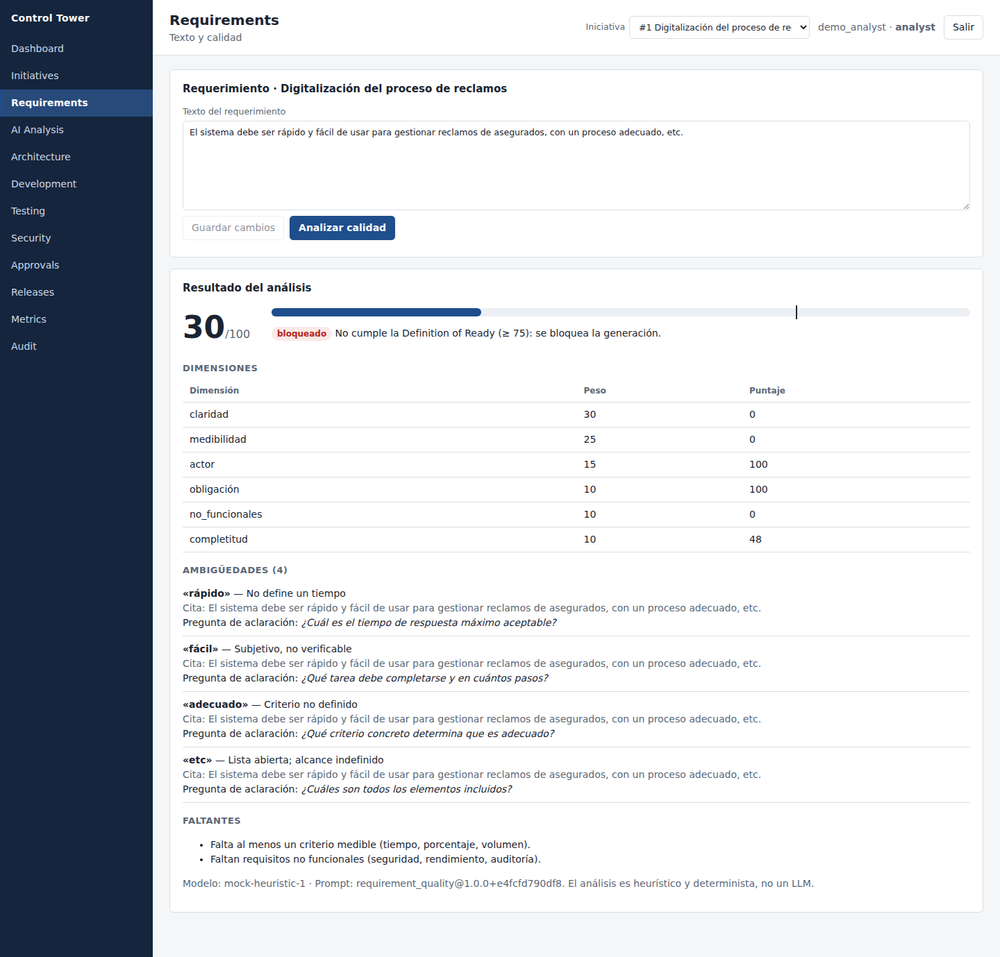
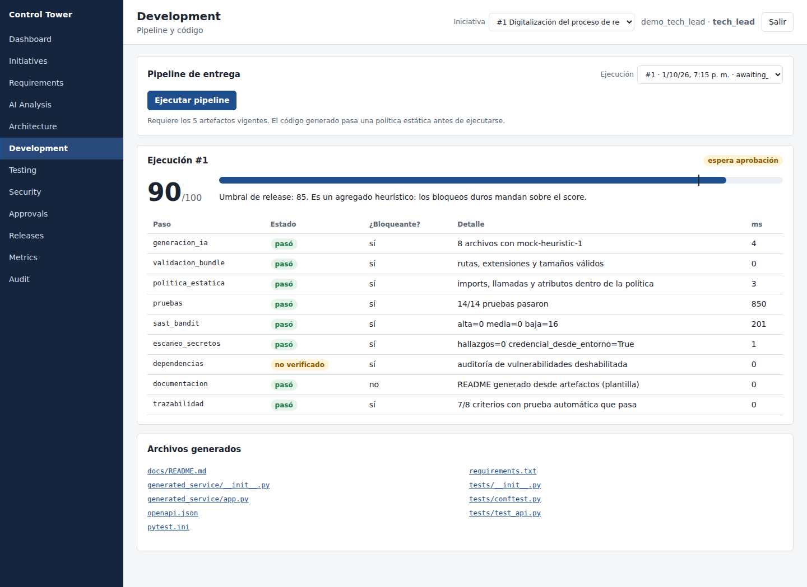
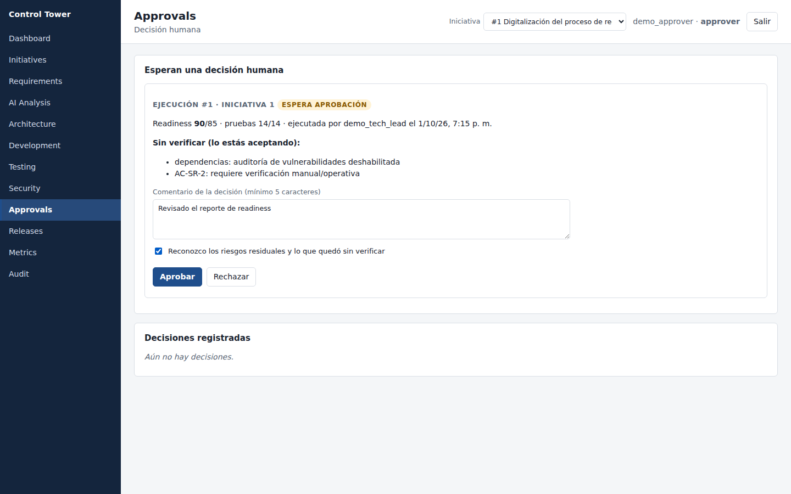
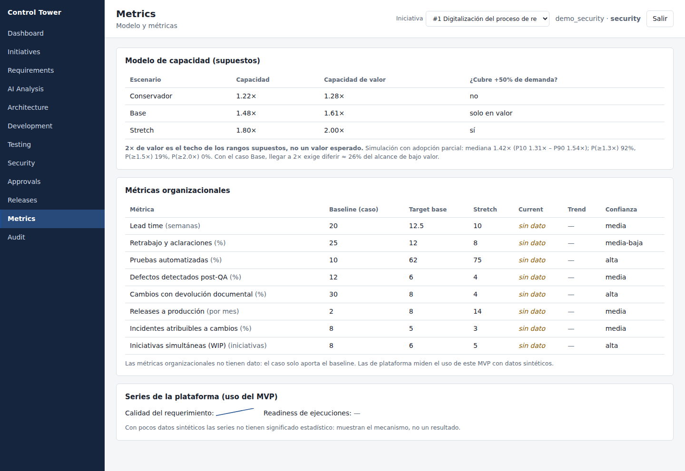

# AI Engineering Control Tower

Demostración ejecutable de una propuesta para el caso ejecutivo **Director de Soluciones de Software** (transformación AI-First del ciclo de
desarrollo en una aseguradora regulada de El Salvador). Es **un MVP con datos 100% sintéticos**, no un producto, y el proveedor de IA es un
**mock determinista, no un modelo de lenguaje**: demuestra el flujo y los controles, no la calidad de un LLM.

> **Tesis.** Duplicar la capacidad no significa duplicar el esfuerzo humano. La capacidad se recupera del retrabajo, el trabajo manual y la espera;
> la IA multiplica un sistema rediseñado, con calidad, seguridad, cumplimiento y trazabilidad integrados al flujo y aprobación siempre humana.

| Bloqueo de un requerimiento pobre | Pipeline y readiness |
|---|---|
|  |  |
| **Aprobación humana segregada** | **Modelo de capacidad (supuestos)** |
|  |  |

## Qué hace (todo ejecutable y probado)

Requerimiento → **Definition of Ready con score** → historias, criterios, riesgos, arquitectura y contrato OpenAPI (cada elemento cita su fuente)
→ código y pruebas generados por un **Model Gateway** → **política estática** antes de ejecutar → pruebas contra el contrato → SAST, secretos y
dependencias → evidencia y readiness → **aprobación humana segregada** → **release reproducible** con hashes → **auditoría con hash encadenado**.

## Estado real (sin adornos)

| Área | Estado | Evidencia |
|---|---|---|
| Backend (FastAPI), RBAC, auditoría, gateway, evaluación de IA, pipeline | **Implementado y probado** | 148 pruebas pasan, también contra **PostgreSQL 16 real** |
| UI Control Tower (React + TypeScript, 12 secciones) | **Implementado y probado** | 27 pruebas + **E2E de 16 verificaciones en navegador real** |
| Modelo de productividad, simulación y retorno | **Implementado y probado** | 14 pruebas; documentos verificados contra el código (`scripts/check_docs.py`) |
| Proveedor de IA | **Mock determinista** | No es un LLM; un LLM real debe superar el mismo gate de evaluación |
| Sandbox del código generado | **De proceso, no de contenedor** | Suficiente para la demo; **no** para un LLM real en producción |
| `Dockerfile`, `docker-compose.yml`, CI en GitHub Actions | **Escritos, NO ejecutados** | Sintaxis validada; no hubo demonio de Docker ni runner |
| RAG / base vectorial, OpenTelemetry, OIDC, módulo de incidentes | **Solo diseño** | Ver `docs/ARCHITECTURE.md` y `docs/SECURITY.md` |

## Arranque rápido

Requiere **Python 3.10 o superior** y, para la interfaz, Node 18+. **Un solo comando**, desde cualquier carpeta y en cualquier consola (PowerShell, CMD, Git Bash, Linux, macOS):

```bash
python scripts/demo.py            # en Windows, si `python` no responde: py scripts/demo.py
```

Crea el entorno virtual, instala dependencias, compila la interfaz, siembra los usuarios demo y arranca en **http://127.0.0.1:8765**. Imprime la contraseña (la misma para todos los usuarios demo). Opciones: `--port 9000`, `--no-ui` (sin Node), `--reset` (empezar de cero), `--dry-run`. La guía de la demo y los pasos manuales están en [`docs/DEMO_SCRIPT.md`](docs/DEMO_SCRIPT.md). Probado en Linux con Python 3.10 y 3.11; **no se ha ejecutado en un Windows real**.

## Verificar por tu cuenta

```bash
cd backend && ruff check . && mypy app && bandit -q -r app && pip-audit -r requirements.txt
python -m pytest -q                     # 148 pruebas (1 opcional con RUN_ONLINE_TESTS=1)
python -m app.ai.evaluation             # gate de evaluación de IA (15 métricas); sale con 1 si falla
cd .. && pip install -r backend/requirements-pgtest.txt && python scripts/test_postgres.py   # toda la suite contra PostgreSQL real (opcional)
python scripts/check_docs.py && python scripts/check_ui_permissions.py
cd frontend && npm run typecheck && npm test && npm run build
```

## Documentación

| Para la presentación | Para el diseño | Para la verificación |
|---|---|---|
| [`EXECUTIVE_STORY`](docs/EXECUTIVE_STORY.md) · [`PRESENTATION`](docs/PRESENTATION.md) (8 láminas · [`.pptx`](docs/presentacion-director-soluciones.pptx)) · [`SPEAKER_SCRIPT`](docs/SPEAKER_SCRIPT.md) (20 min) · [`QA`](docs/QA.md) (33 preguntas) · [`DEMO_SCRIPT`](docs/DEMO_SCRIPT.md) | [`OPERATING_MODEL`](docs/OPERATING_MODEL.md) · [`AI_GOVERNANCE`](docs/AI_GOVERNANCE.md) · [`USE_CASES`](docs/USE_CASES.md) (25) · [`ARCHITECTURE`](docs/ARCHITECTURE.md) · [`TECH_DECISION_MATRIX`](docs/TECH_DECISION_MATRIX.md) · [`DECISIONS`](docs/DECISIONS.md) · [`ROADMAP`](docs/ROADMAP.md) | [`PRODUCTIVITY_MODEL`](docs/PRODUCTIVITY_MODEL.md) · [`METRICS`](docs/METRICS.md) · [`REGULATORY`](docs/REGULATORY.md) · [`SECURITY`](docs/SECURITY.md) · [`RISKS`](docs/RISKS.md) · [`ASSUMPTIONS`](docs/ASSUMPTIONS.md) |

## Lo que hay que saber antes de usar estas cifras

- **2× de valor es el techo de los rangos supuestos, no un valor esperado.** El modelo da 1.22× / 1.48× / 1.80× de capacidad y 1.28× / 1.61× / 2.00× de valor;
  con adopción parcial la simulación da una mediana de 1.42×. El caso Base (1.48×) no cubre por sí solo el +50% de demanda. Ver `docs/PRODUCTIVITY_MODEL.md`.
- Los datos del caso y las cifras de palancas, costos y retorno son **supuestos** con su forma de validación en `docs/ASSUMPTIONS.md`.
- **No se afirma cumplimiento regulatorio.** `docs/REGULATORY.md` distingue requisito confirmado (NRP-23, leída del texto oficial, aplica a sociedades de seguros),
  control recomendado y lo que está por confirmar con Cumplimiento (p. ej. la ley de protección de datos personales).
- Los conjuntos de referencia de la evaluación son pocos y los escribió el autor.
